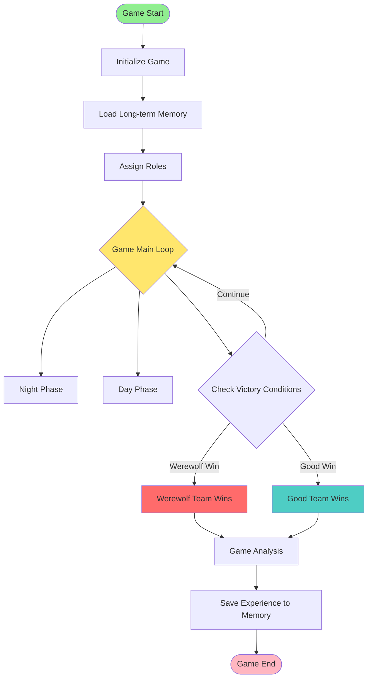
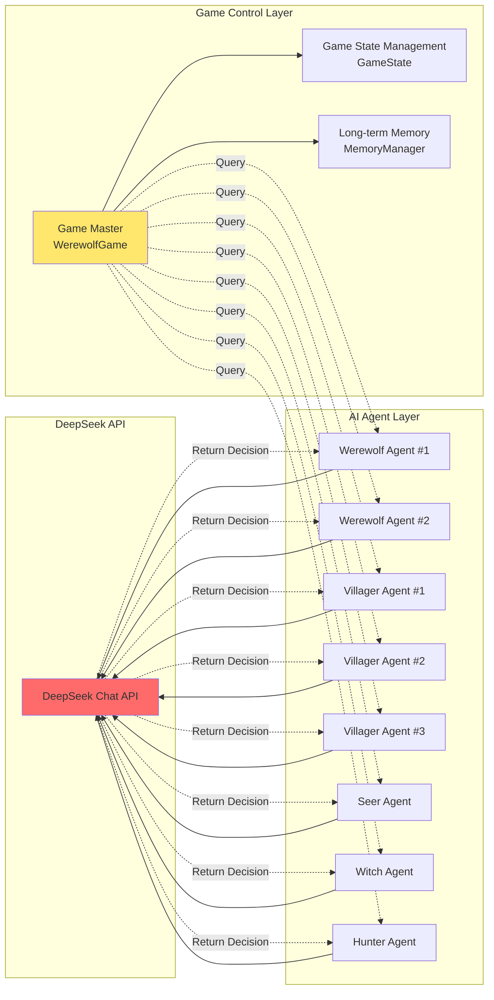

# 🐺 Werewolf Multi-Agent System Architecture Flow Diagram

## Overall Architecture Diagram

```mermaid
graph TB
    Start([Game Start]) --> Init[Initialize Game]
    Init --> LoadMemory[Load Long-term Memory]
    LoadMemory --> AssignRoles[Assign Roles]
    AssignRoles --> GameLoop{Game Main Loop}

    GameLoop --> NightPhase[Night Phase]
    GameLoop --> DayPhase[Day Phase]
    GameLoop --> CheckWin{Check Victory Conditions}

    CheckWin -->|Werewolf Win| WolfWin[Werewolf Team Wins]
    CheckWin -->|Good Win| GoodWin[Good Team Wins]
    CheckWin -->|Continue| GameLoop

    WolfWin --> Analysis[Game Analysis]
    GoodWin --> Analysis
    Analysis --> SaveMemory[Save Experience to Memory]
    SaveMemory --> End([Game End])

    style Start fill:#90EE90
    style End fill:#FFB6C1
    style WolfWin fill:#FF6B6B
    style GoodWin fill:#4ECDC4
    style GameLoop fill:#FFE66D
```

## Multi-Agent Interaction Architecture

```mermaid
graph LR
    subgraph "DeepSeek API"
        API[DeepSeek Chat API]
    end

    subgraph "Game Control Layer"
        GameMaster[Game Master<br/>WerewolfGame]
        GameState[Game State Management<br/>GameState]
        Memory[Long-term Memory<br/>MemoryManager]
    end

    subgraph "AI Agent Layer"
        Wolf1[Werewolf Agent #1]
        Wolf2[Werewolf Agent #2]
        Villager1[Villager Agent #1]
        Villager2[Villager Agent #2]
        Villager3[Villager Agent #3]
        Seer[Seer Agent]
        Witch[Witch Agent]
        Hunter[Hunter Agent]
    end

    GameMaster --> GameState
    GameMaster --> Memory

    GameMaster -.Query.-> Wolf1
    GameMaster -.Query.-> Wolf2
    GameMaster -.Query.-> Villager1
    GameMaster -.Query.-> Villager2
    GameMaster -.Query.-> Villager3
    GameMaster -.Query.-> Seer
    GameMaster -.Query.-> Witch
    GameMaster -.Query.-> Hunter

    Wolf1 --> API
    Wolf2 --> API
    Villager1 --> API
    Villager2 --> API
    Villager3 --> API
    Seer --> API
    Witch --> API
    Hunter --> API

    API -.Return Decision.-> Wolf1
    API -.Return Decision.-> Wolf2
    API -.Return Decision.-> Villager1
    API -.Return Decision.-> Villager2
    API -.Return Decision.-> Villager3
    API -.Return Decision.-> Seer
    API -.Return Decision.-> Witch
    API -.Return Decision.-> Hunter

    style GameMaster fill:#FFE66D
    style API fill:#FF6B6B
```
