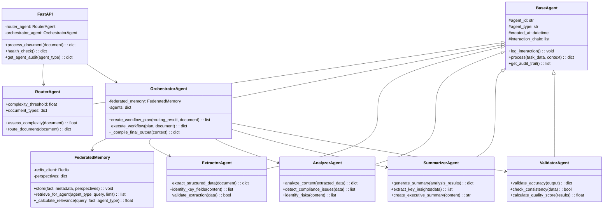

# DocuMinds Multi-Agent System Architecture Flow Diagram

## Overall Architecture Diagram

## Multi-Agent Interaction Architecture

## Simple Document Processing Flow

## Complex Document Processing Flow

## Single Agent Decision Flow

## Federated Memory System Flow

## Core Class Relationship Diagram

## Data Flow Architecture

